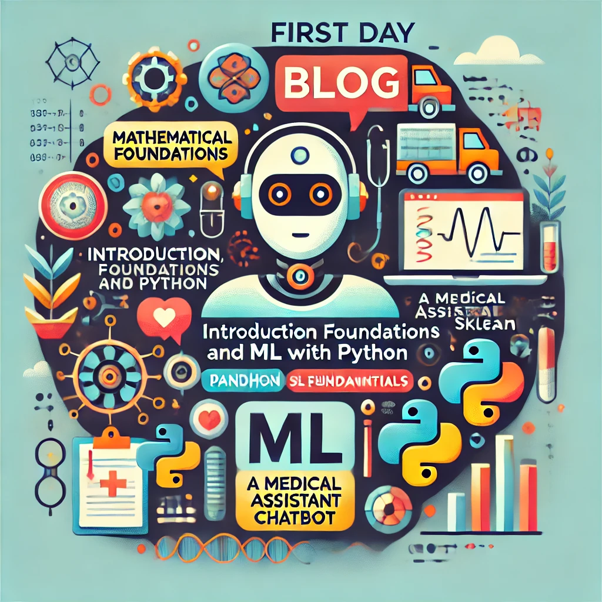

# Day 01: 大致介紹,數理跟ＭＬ基礎,短課程和side project實作

# 目錄

- [參賽目的](#參賽目的)
- [AI簡介](#AI簡介)
- [數理基礎概略](#數理基礎概略)
- [機器學習概略](#機器學習概略)
- [兩DLAI短課程實作](#兩DLAI短課程實作)
- [醫療Chatbot實作內容](#醫療Chatbot實作內容)

## 參賽目的

參加這次為期30天的部落格挑戰，主要目的是建立一個個人的LLM和深度學習（DL）知識庫，以及完成數個小型的side project。這將有助於我快速復習已掌握的知識，同時也能夠快速分類、吸收和內化新知識，並將其付諸實踐。此外，這個知識筆記還能方便他人了解目前LLM相關技術的進展，並使用筆記中的流程和程式碼生成自己的應用。
目前，這個知識庫的內容將圍繞深度學習、大模型、Agent等相關主題。這次挑戰的目的是深入探索LLM的各個方面，並通過實際專案應用這些知識，提升我的技術能力並分享我的學習成果。
每一天的內容將展示我實作和添加的過程。
目前暫定的內容

1. AI工程師大補帖
1-1 LLM課程擴展與添加 主要內容將基於https://github.com/mlabonne/llm-course 進行延伸和添加，涵蓋從基礎概念到進階應用的全面介紹。我將深入解析該課程中的重點，並補充更多實際案例和應用技巧。
1-2 deeplearning.ai 上的短課程以及轉化的實作 參考 deeplearning.ai 上所有的短課程內容，這些課程將涵蓋最新的AI技術和工具，包括但不限於以下主題：
    • 語言模型的預訓練和微調
    • 高效提示工程
    • 多模態檢索和生成應用
    • LLM在邊緣設備上的部署
    • 強化學習和人類反饋
1-3 論文閱讀 在挑戰期間，我將閱讀並分析兩篇重要的LLM相關論文，分享其中的關鍵發現和應用。
1-4 Stable Diffusion相關內容 探索和應用Stable Diffusion技術，深入理解其在圖像生成和處理方面的應用。
1-5 其他生成式AI相關的內容
2. 數個小 side project
我將設計並實作以下數個與LLM相關的實際專案：
    • 醫療聊天機器人：利用LLM技術開發一個能夠回答醫療相關問題的聊天機器人，目的是提供精確且即時的醫療資訊輔助。
    • 代碼LLM程式插件：開發一個能夠輔助編寫和調試代碼的程式插件，提升開發效率和代碼質量。
    • RPA + LLM：結合機器人流程自動化（RPA）和LLM技術，設計一個自動化工作流程系統，提升企業的運營效率。
期待成果
通過這次挑戰，我希望能夠更加深入掌握LLM以及生成式AI的技術及其應用，並完成三個具有實際價值的專案。此外，我將通過閱讀並理解關鍵論文，掌握從論文閱讀、程式碼理解到吸收內化和產生新題目的整個過程。

## AI簡介

### 人工智慧（AI）的發展歷史

人工智慧的發展歷史充滿了突破性的理論、技術進步和應用創新。以下是按照主要分類來講述AI的發展歷程。

#### 1950s-1960s：AI的萌芽與早期發展

- **起源**：AI的概念最早由艾倫·圖靈提出，他在1950年發表的論文《計算機械與智能》中提出了圖靈測試。
- **早期研究**：1956年，達特茅斯會議被認為是AI研究的起點。研究者們希望能夠通過模擬人類智能來創建智能機械。
- **早期技術**：
  - **專家系統**：用來模擬專家的決策過程。
  - **初步的機器學習**：主要是基於規則和邏輯的系統。

#### 1970s-1980s：知識驅動與專家系統

- **知識表示**：強調將專家知識編碼進計算機系統，並利用推理引擎來模擬專家決策。
- **專家系統的興起**：如MYCIN和DENDRAL系統，成功地應用在醫學診斷和化學分析中。
- **限制**：計算能力和數據的缺乏限制了這些系統的性能和應用範圍。

#### 1990s：機器學習的突破

- **統計學習方法**：引入了統計方法，如貝葉斯網絡和隱馬爾可夫模型，改善了AI系統的性能。
- **神經網絡**：受限於計算能力，早期的神經網絡未能廣泛應用，但為後來的深度學習奠定了基礎。
- **支援向量機（SVM）**：成為一種強大的分類工具，廣泛應用於模式識別和數據挖掘中。

#### 2000s：大數據和深度學習的崛起

- **大數據時代**：隨著互聯網的普及和數據量的爆炸式增長，大數據技術和分佈式計算技術（如Hadoop和Spark）為AI提供了豐富的訓練數據。
- **深度學習**：
  - **突破性進展**：Geoffrey Hinton等人在2006年提出了深度置信網絡（DBN），掀起了深度學習的熱潮。
  - **應用**：深度學習在圖像分類（如AlexNet）、語音識別和自然語言處理（如BERT和GPT）等領域取得了巨大成功【59†source】【60†source】。

#### 2010s至今：人工智能的廣泛應用與進一步突破

- **強化學習**：如DeepMind的AlphaGo，通過強化學習擊敗了人類圍棋冠軍，展示了AI在複雜決策任務中的潛力。
- **自然語言處理（NLP）**：
  - **大型語言模型（LLM）**：如GPT-3，能夠生成逼真的文本，應用於聊天機器人、自動文檔生成等領域【61†source】。
- **計算機視覺**：包括物體檢測、圖像分割和自動駕駛技術，已經廣泛應用於安防、醫療和自動駕駛等領域。
- **無監督學習和半監督學習**：如自編碼器（Autoencoders）和生成對抗網絡（GANs），在數據生成和降維等方面發揮了重要作用【62†source】。
- **語音處理**：包括語音識別和語音合成技術，已經應用於智能助手（如Siri和Alexa）和語音轉文字等領域。

### 結論

AI的發展歷史展示了從早期基於規則的系統到現代基於數據驅動的學習算法的演進過程。隨著計算能力和數據量的不斷增長，AI技術將在更多的應用領域中發揮關鍵作用。
## 數理基礎概略

## 機器學習概略

## 兩DLAI短課程實作

## 醫療Chatbot實作內容